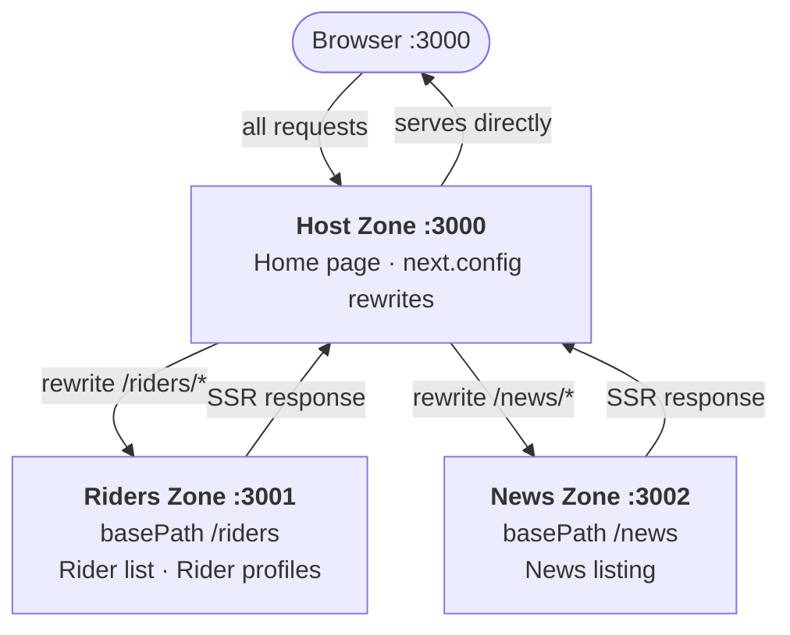

# TeamRedBullMFE

A monorepo demonstrating **server-side Micro-Frontend composition** using Next.js Multi-Zones. The primary goal is to practise MFE architecture patterns through SSR — the content (a fictional Red Bull cycling team website) is not the focus.

## Architecture

Server-side composition: the **host** zone owns the entry point and uses Next.js `rewrites` to proxy requests to the correct zone (works like reverse proxy in nginx). Each zone is an independent Next.js App Router application.



| App           | Port | basePath  | Role                                      |
| ------------- | ---- | --------- | ----------------------------------------- |
| `apps/host`   | 3000 | (none)    | Entry point — home page + rewrite router  |
| `apps/riders` | 3001 | `/riders` | Rider list + individual SSR profile pages |
| `apps/news`   | 3002 | `/news`   | News articles listing                     |

Each zone is an independent Next.js App Router app with its own:

- `package.json` and dependency tree
- `next.config.ts` (`basePath` + `assetPrefix`)
- Pages, components, and data layer

## Tech Stack

- **Next.js 15** — App Router, SSR by default
- **React 19** + **TypeScript**
- **Material UI v6** — component library
- **npm Workspaces** — monorepo package management
- **concurrently** — run all zones in a single `npm run dev`

## Prerequisites

**Node.js 20+** and **npm 10+** are required.

```sh
# Verify node & npm
node --version
npm --version
```

## Getting Started

```sh
# 1. Clone the repo
git clone <repo-url>
cd TeamRedBullMFE

# 2. Install all workspace dependencies
npm install

# 3. Start all three zones concurrently
npm run dev
```

This starts three processes:

| Process     | URL                          |
| ----------- | ---------------------------- |
| Host zone   | http://localhost:3000        |
| Riders zone | http://localhost:3001/riders |
| News zone   | http://localhost:3002/news   |

Open **http://localhost:3000** in your browser — always use the **host port**.

## Other Scripts

```sh
# Build all zones (riders + news first, then host)
npm run build

# Start all zones in production mode (after build)
npm run start

# Build or start a single zone
npm run dev --workspace=apps/host
npm run dev --workspace=apps/riders
npm run dev --workspace=apps/news
```

## Project Structure

```
TeamRedBullMFE/
├── apps/
│   ├── host/                   # Zone: HOME — port 3000
│   │   ├── app/
│   │   │   ├── components/
│   │   │   │   └── NavBar.tsx  # Cross-zone nav (uses Next.js <Link>)
│   │   │   ├── layout.tsx
│   │   │   ├── page.tsx        # Home page
│   │   │   ├── theme.ts
│   │   │   └── ThemeRegistry.tsx
│   │   └── next.config.ts      # rewrites → riders/news zones (works as a Shell)
│   │
│   ├── riders/                 # Zone: RIDERS — port 3001
│   │   ├── app/
│   │   │   ├── [id]/
│   │   │   │   └── page.tsx    # SSR rider profile
│   │   │   ├── components/
│   │   │   │   └── NavBar.tsx  # Cross-zone nav (uses plain <a> tags)
│   │   │   ├── data/
│   │   │   │   └── riders.ts   # Mock rider data
│   │   │   ├── layout.tsx
│   │   │   ├── page.tsx        # Rider list
│   │   │   ├── theme.ts
│   │   │   └── ThemeRegistry.tsx
│   │   └── next.config.ts      # basePath: '/riders'
│   │
│   └── news/                   # Zone: NEWS — port 3002
│       ├── app/
│       │   ├── components/
│       │   │   └── NavBar.tsx  # Cross-zone nav (uses plain <a> tags)
│       │   ├── data/
│       │   │   └── news.ts     # Mock article data
│       │   ├── layout.tsx
│       │   ├── page.tsx        # News listing
│       │   ├── theme.ts
│       │   └── ThemeRegistry.tsx
│       └── next.config.ts      # basePath: '/news'
│
├── package.json                # npm workspaces + concurrently dev script
└── README.md
```

## How It Works

1. All browser requests arrive at the **host** on port 3000.
2. Next.js `rewrites` in `apps/host/next.config.ts` match `/riders/*` and `/news/*` and proxy them to the respective zone's dev server (or production origin).
3. Each sub-zone has `basePath` set so its internal routes align with those patterns — e.g. the riders zone's root page is `/riders`, not `/`.
4. `assetPrefix` points the browser to each zone's own origin when fetching `_next/static` chunks, preventing 404s in development.
5. Sub-zone `NavBar` components use plain `<a>` tags for cross-zone links. Using Next.js `<Link>` would prepend `basePath` to the href, sending e.g. `/riders/` instead of `/` when navigating home (soft routing within Next.js).
6. Each zone ships its own full HTML shell (layout, ThemeRegistry, NavBar) — there is no shared shell or client-side stitching. Composition is **purely at the routing/proxy layer**.
7. A small **zone badge** in each NavBar identifies which zone is serving the current page, making the architecture boundaries visible during development.

## Production Deployment

In production each zone is deployed as an independent service. An upstream reverse-proxy (Nginx, Vercel Multi-Zones, AWS ALB, etc.) replaces the dev rewrites:

```nginx
location /riders/ { proxy_pass http://riders-service; }
location /news/   { proxy_pass http://news-service;   }
location /        { proxy_pass http://host-service;   }
```

Remove `assetPrefix` from the sub-zone configs (or point it at their CDN origin) and the zones work identically to the dev setup.

## Work in Progress:
- dynamic routing in Riders are giving 404 for the first time
- theme + navigation should be moved into a shared lib for better maintainability
